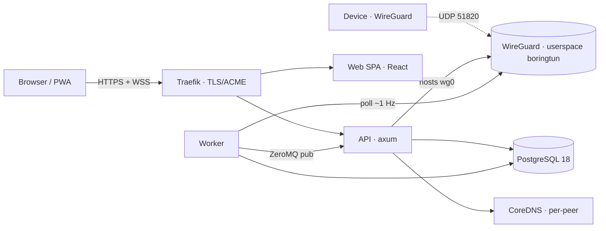

<div align="center">


# ZeroVPN

**Run your own VPN — without running a fleet.**

A self-hosted [WireGuard](https://www.wireguard.com/) control plane: manage devices, peers, and
admin policy from one fast console, with live telemetry and a full audit trail — and no
third-party SaaS anywhere in the data path.

[](https://github.com/bhadri01/ZeroVPN/actions/workflows/ci.yml)
[](https://github.com/bhadri01/ZeroVPN/actions/workflows/images.yml)
[](LICENSE)


**[📖 Website & docs → bhadri01.github.io/ZeroVPN](https://bhadri01.github.io/ZeroVPN/)** · what it is, features, architecture, security, and FAQ.

</div>

> This README is the operator's guide — how to run, configure, and deploy ZeroVPN.
> For the "what & why" (features, architecture, security posture, FAQ) see the
> **[project website](https://bhadri01.github.io/ZeroVPN/)**.

---

## Contents

- [Why ZeroVPN](#why-zerovpn)
- [Features](#features)
- [Architecture](#architecture)
- [Requirements](#requirements)
- [Quickstart (dev)](#quickstart)
- [Other dev loops](#other-dev-loops)
- [Quickstart (production)](#quickstart-production)
- [Configuration](#configuration)
- [Make targets](#make-targets)
- [Health & observability](#health--observability)
- [Project layout](#project-layout)
- [Documentation](#documentation)
- [Contributing](#contributing)
- [Security](#security)
- [Roadmap](#roadmap)
- [License](#license)

---

## Why ZeroVPN

ZeroVPN is a control plane for a WireGuard network **you** host. It handles the
device lifecycle (keypairs, IP allocation, revocation), gives users a live console over
their own peers, and gives admins full visibility — users, quotas, sessions, and an audit
trail — over the whole fleet. It scales from a single homelab box, to a small team of
10–50 peers, to a compliance operator who has to answer "who did what, from where".

**Honest scope:** ZeroVPN is a **private-network access VPN**. Each device split-tunnels
only the VPN's own subnet (`10.10.0.0/22` by default), connecting your people to your
machines. It is deliberately **not** a full-tunnel or anonymity product.

## Features

**For everyone**

- **Device provisioning** — server-generated keypairs, IP allocation, and a ready
  `.conf` + QR code to scan into the WireGuard app.
- **Real-time telemetry** — worker → ZeroMQ → API → WebSocket at ~1 Hz; samples are
  stored and replayed on refresh so charts are never empty on reload.
- **Topology & flows** — a two-level tree that mirrors WireGuard's model, plus a live
  flows view; layout persists per user.
- **Per-device stats & lifecycle** — bandwidth, handshake and endpoint history, and a
  timeline of every lifecycle event.
- **TOTP & recovery codes** — RFC 6238 authenticator support with hashed recovery codes
  (regenerable from the Security page), opt-in per account and enforced on the Google
  sign-in path too.
- **Session management** — an Active-sessions panel (client, IP, last activity) with
  per-session revoke and one-click "sign out everywhere else".
- **Installable PWA** — home-screen install, with in-app and OS notifications for
  connectivity, quota, security, and lifecycle events.

**For admins**

- **User control** — suspend, quota, key-rotate, and impersonate for support.
- **Device moderation** — pause, resume, or revoke any device directly (WG peer, IP
  lease, and DNS names torn down atomically) without touching the owner's account.
- **Fleet** — manage WireGuard hub servers, review the session & security event log
  (logins, 2FA, impersonation), and view a fleet-wide topology.
- **Audit & access logs** — append-only audit log (filterable, with CSV export), a
  failed-login board, and filterable access logs.
- **Quotas & maintenance** — per-user bandwidth quotas with auto-pause, plus a
  maintenance mode.

## Architecture

Rust workspace (multiple crates) + a React/Vite SPA, one Docker Compose stack. The **API**
brings up the WireGuard interface in its own container using **userspace boringtun** — no
separate `wg` sidecar, no host kernel module. The **worker** shares the API's network
namespace, polls peer stats, and publishes tick-level samples over ZeroMQ, which the API
relays to the browser over a WebSocket (MessagePack-encoded).



Full write-up: **[docs/architecture.md](docs/architecture.md)**.

## Requirements

- **Deploy:** Docker + Compose v2, ~1 GB RAM / 1 vCPU baseline. Open ports: `80`/`443`
  (tcp), `51820` (udp), plus `22` for the host.
- **Native dev (optional):** the pinned Rust toolchain (`1.95`, edition 2024 — auto-selected
  by [`rust-toolchain.toml`](rust-toolchain.toml)) and Node.js + pnpm (see
  [`web/package.json`](web/package.json)).

<a id="quickstart"></a>

## Quickstart (dev)

The fastest loop — everything in Linux containers with hot-reload and a **real userspace
WireGuard tunnel** (works on macOS too):

```bash
git clone https://github.com/bhadri01/ZeroVPN
cd ZeroVPN

make setup      # copy .env.example → .env and generate secrets (session, db, KEK)
make up-dev     # build + start api/worker/web in Linux; the API auto-migrates on boot
```

Then open:

| Service       | URL                              |
| ------------- | -------------------------------- |
| Web (Vite)    | <http://localhost:6173>          |
| API (debug)   | <http://localhost:18080>         |
| WireGuard     | `udp/51820` on your LAN IP       |

**Register the first user — they are promoted to admin automatically.** First build/compile
takes a few minutes; watch it with `make logs-dev`.

> **Dev email:** with `ZEROVPN_SMTP__HOST` unset (the default), the API doesn't send mail —
> it **logs** every verification / reset link, so grab them from `make logs-dev`. Point the
> SMTP block at a real relay (or a manually-layered MailHog) to send for real.

> Note: `make migrate` and `make bootstrap-admin` target the **prod** `api` container. With
> the `up-dev` stack the API migrates itself on boot, and you bootstrap the admin by simply
> registering the first account.

## Other dev loops

- **Fully-dockerized** (`make up`): the core stack behind Traefik at
  <https://localhost> (self-signed cert). Pair with `make migrate` and
  `make bootstrap-admin EMAIL=you@example.com`.
- **Native** (`make dev`): runs `db`/dns/mail in Docker and leaves the api, worker, and web
  to run natively for the fastest iteration — `make dev-api`, `make dev-worker`,
  `make dev-web` in separate terminals.

<a id="quickstart-production"></a>

## Quickstart (production)

App images are **built + pushed to a registry**, and the deploy host **pulls** them (never
builds). Every build is tagged twice — `$ZEROVPN_IMAGE_TAG` (the deploy pointer, usually
`latest`) **and** `sha-<git commit>` for rollback:

```bash
# Build + push images (CI does this on push to main/tags; or locally after `docker login`):
make images && make push        # → zerovpn-*:$ZEROVPN_IMAGE_TAG  +  zerovpn-*:sha-<commit>

# On the deploy host:
make setup                      # copy .env.example → .env and generate secrets
$EDITOR .env                    # production values (see below)
make up-prod                    # pull the pre-built images and start (no dev profile)
make bootstrap-admin EMAIL=admin@your-domain
```

Production differs from dev only in `.env`: `ZEROVPN_ENVIRONMENT=production`, a real
`ZEROVPN_DOMAIN` / `ZEROVPN_PUBLIC_URL`, a real SMTP relay, `ZEROVPN_CERT_RESOLVER=le`
(Traefik + Let's Encrypt) with `ZEROVPN_ACME_EMAIL`, and `ZEROVPN_REGISTRY` /
`ZEROVPN_IMAGE_TAG`. The API refuses to boot in production with `CHANGEME` secrets or a
placeholder domain, and runs its migrations itself on startup. See the
[runbook](docs/runbook.md#dev-vs-prod-isolation) for the full dev/prod table.

> **Redeploys need `git pull` on the host, not just new images.** The reverse-proxy
> routing (`deploy/traefik-dynamic.yml`), the compose files, and the Makefile are read
> from the host's checkout — images alone don't carry them. A routine update is:
>
> ```bash
> git pull && make up-prod && make smoke
> ```
>
> **Rollback:** set `ZEROVPN_IMAGE_TAG=sha-<last-good-commit>` in the host's `.env` and
> re-run `make up-prod`. Migrations are additive, so older images run fine against a
> newer schema.

## Configuration

All config is environment-driven — see [`.env.example`](.env.example) for every key, grouped
by concern (core, database, SMTP, WireGuard, TLS, registry). Secrets are generated by
[`./scripts/init-secrets.sh`](scripts/init-secrets.sh) (run via `make setup`): the session
secret, the database password, and the **key-encryption key (KEK)**.

Two knobs worth knowing about up front: `ZEROVPN_SESSION_IDLE_MINUTES` sets the sign-in
idle window (defaults: 7 days in production, 30 in dev — every authenticated request
refreshes it), and the mail-sending auth endpoints (register / resend-verify /
forgot-password) are always rate-limited per address **and** per client IP to protect
your SMTP relay's quota.

> ⚠️ **Guard the KEK.** It seals column-level secrets (TOTP seeds and WireGuard device &
> server private keys). There is no HSM and no automatic rotation — if you lose it, those
> secrets cannot be decrypted and users must re-enroll 2FA. Keep a copy off-box.

## Make targets

Run `make help` for the live list. The essentials:

| Target                    | What it does                                                        |
| ------------------------- | ------------------------------------------------------------------ |
| `make setup`              | Copy `.env.example` → `.env` and generate secrets                  |
| `make up-dev`             | Dev containers: api/worker/web in Linux, hot-reload + real WG      |
| `make down-dev`           | Stop the dev containers                                            |
| `make logs-dev`           | Tail dev-container logs                                            |
| `make up`                 | Start the fully-dockerized dev stack behind Traefik               |
| `make up-prod`            | Deploy prod from pre-built images (pull, never build)             |
| `make images` / `push`    | Build / push the app images (`$ZEROVPN_IMAGE_TAG` + `sha-<commit>`) |
| `make down`               | Stop the stack                                                     |
| `make dev`                | Native loop: infra in Docker, app processes native                |
| `make dev-api` / `-worker` / `-web` | Run each process natively against the dockerized infra  |
| `make migrate`            | Run pending DB migrations (prod `api` container)                  |
| `make bootstrap-admin EMAIL=…` | Create the first admin user                                  |
| `make test` / `test-it`   | Workspace unit tests / DB integration tests (needs Docker)        |
| `make smoke`              | End-to-end smoke test against the running stack                   |
| `make check`              | `cargo check` + `clippy` + `tsc` + `eslint`                       |
| `make fmt`                | Format Rust + web                                                 |
| `make clean`              | **Destructive:** remove containers, volumes, and build artifacts  |

## Health & observability

The API exposes `/health` (liveness), `/ready` (readiness), `/metrics` (Prometheus), and
`/openapi.json` (the live OpenAPI spec).

## Project layout

```
.
├── crates/                        # Rust workspace
│   ├── zerovpn-core/              # domain types
│   ├── zerovpn-db/                # sqlx queries
│   ├── zerovpn-wg/                # WireGuard control
│   ├── zerovpn-auth/              # password (Argon2), sessions, TOTP, KEK
│   ├── zerovpn-wire/              # shared wire schema (MessagePack)
│   ├── zerovpn-dns/               # per-peer DNS hosts-file writer (served by CoreDNS)
│   ├── zerovpn-mail/              # SMTP via lettre (sent by the API)
│   ├── zerovpn-api/               # axum HTTP + WS binary; hosts wg0; ZeroMQ relay
│   ├── zerovpn-worker/            # WG poller, bandwidth aggregator, retention purger
│   └── zerovpn-cli/               # admin CLI (migrate, bootstrap-admin)
├── migrations/                    # sqlx migrations
├── web/                           # React + Vite frontend (PWA)
├── deploy/                        # Dockerfiles, Traefik/CoreDNS config
├── docs/                          # website + architecture, runbook, API
├── Makefile · docker-compose*.yml · .env.example · CHANGELOG.md
```

## Documentation

- **[Website](https://bhadri01.github.io/ZeroVPN/)** — features, architecture, security, FAQ
- **[docs/architecture.md](docs/architecture.md)** — components, data flow, WireGuard transport
- **[docs/API.md](docs/API.md)** — HTTP API overview (live spec at `/openapi.json`)
- **[docs/app-connect-endpoint.md](docs/app-connect-endpoint.md)** — the device connect endpoint
- **[docs/runbook.md](docs/runbook.md)** — deploy, restore drills, and the security checklist
- **[CHANGELOG.md](CHANGELOG.md)** — current state and history

## Contributing

Contributions welcome — see **[CONTRIBUTING.md](CONTRIBUTING.md)**. In short: `make check`
(cargo check + clippy + tsc + eslint) and `make test` must pass, and `make fmt` before you
push.

## Security

Please report vulnerabilities privately — see **[SECURITY.md](SECURITY.md)**. ZeroVPN is
transparent about its limits: keys are stored server-side (not zero-knowledge), the KEK is a
single operator-provided secret, and it is split-tunnel only. Login is rate-limited per
email, the mail-sending endpoints per email + client IP, TOTP is enforced on the Google
sign-in path too, and sessions are individually revocable from the Security page. The full
posture — including what it does and does not log — is on the
[security section](https://bhadri01.github.io/ZeroVPN/#security) of the website.

## Roadmap

Shipped today: device management, live telemetry, topology/flows, TOTP (with Google-OAuth
2FA and recovery-code rotation), session management, admin console with device moderation,
audit logging, quotas, rate limiting, PWA. On the roadmap: automatic multi-region failover,
webhooks, OIDC/SAML SSO, a native mobile app, and a stable OpenAPI v1.

## License

**[AGPL-3.0-or-later](LICENSE).** Note the AGPL's §13 network-use clause: if you run a
**modified** version as a network service, you must offer its corresponding source to your
users. Self-hosting an unmodified copy carries no such obligation.
